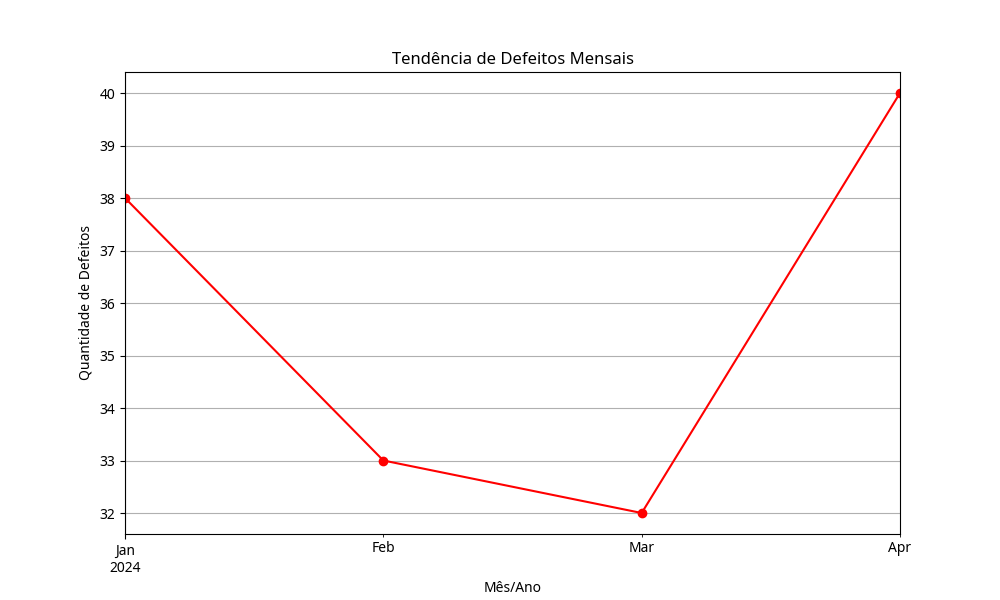
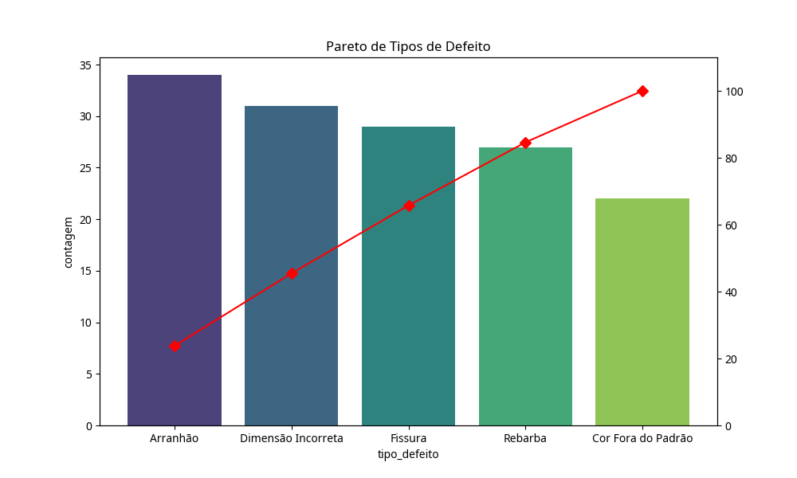
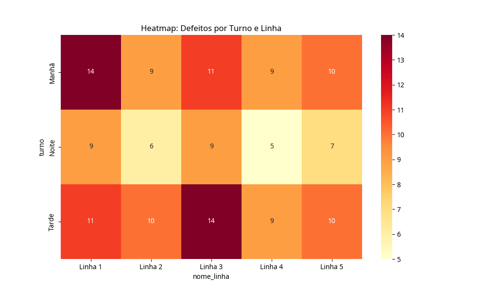

# Análise de Qualidade Industrial

## Problema de Negócio
Este projeto visa analisar a qualidade na produção industrial, identificando gargalos, tipos de defeitos mais frequentes e custos associados ao retrabalho. O objetivo é fornecer insights para a redução de desperdícios e melhoria da eficiência das linhas de produção.

## Metodologia
1.  **Coleta de Dados**: Simulação de um dataset de manufatura com 1000 registros de inspeção.
2.  **Armazenamento**: Utilização de SQLite para gerenciar tabelas de produtos, linhas e inspeções.
3.  **Análise SQL**: Criação de queries para responder perguntas críticas de negócio (taxa de defeito, custos, tendências).
4.  **Análise Python**: Uso de Pandas para manipulação e Matplotlib/Seaborn para visualizações avançadas (Pareto, Heatmap, Tendência).

## Resultados e Visualizações

### Tendência de Defeitos
Acompanhamento mensal da quantidade de não conformidades para identificar sazonalidade ou problemas recorrentes.

### Pareto de Defeitos
Identificação dos tipos de defeitos que representam a maior parte dos problemas (Regra 80/20).

### Heatmap por Turno e Linha
Visualização de onde e quando os defeitos ocorrem com maior frequência.

## Conclusões de Negócio
-   As linhas com maior taxa de defeito foram identificadas via SQL, permitindo intervenções focadas.
-   O custo de retrabalho ajuda a priorizar quais produtos ou linhas precisam de manutenção urgente.
-   O turno da noite apresentou padrões específicos de defeitos que sugerem necessidade de treinamento ou revisão de iluminação/processos.

## Tecnologias Utilizadas
-   **SQL (SQLite)**
-   **Python (Pandas, Matplotlib, Seaborn)**
-   **GitHub**
